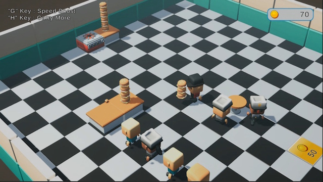

# Portfolio

## Unity3D – BurgerSample

햄버거를 조리해 손님에게 판매하고, 얻은 수익으로 매장 설비를 확장하는 캐주얼 경영 샘플게임입니다.

플레이어가 작업대에 접근하면 상황에 맞는 상호작용이 자동으로 실행됩니다. 스토브에서 완성된 햄버거를 집고, 카운터에서 대기 중인 손님에게 판매하며, 획득한 재화로 스토브·카운터·테이블을 해금할 수 있습니다.



## 게임 목표

짧은 플레이 안에서 `조리 → 운반 → 판매 → 재투자 → 매장 확장`으로 이어지는 핵심 루프를 검증하는 데 목적을 두었습니다. 완성된 콘텐츠의 양보다 기능 간 결합도를 낮추고, 새로운 작업대와 성장 요소를 쉽게 추가할 수 있는 구조에 집중했습니다.

## 주요 기능

- 스토브의 햄버거 자동 조리 및 최대 적재량 관리
- 플레이어의 동일 타입 아이템 적재·운반 시스템
- 카운터의 햄버거와 대기 중인 손님을 연결하는 자동 판매
- 손님 생성, 대기열 정렬, 빈 좌석 배정, 식사 후 퇴장
- 재화를 일정 속도로 소비해 설비를 해금하는 Action Spot
- 이동 속도와 최대 운반 개수를 일시적으로 높이는 파워업
- 재화 변경 이벤트와 연동한 HUD
- ScriptableObject 기반 밸런스 데이터 분리
- 햄버거 오브젝트 풀링
- Input System의 `InputAction` 콜백을 이용한 입력 처리
- Addressables 기반 손님 외형 비동기 로딩

## 게임 흐름

1. 스토브에서 조리가 완료된 햄버거를 자동으로 집습니다.
2. 카운터로 이동해 들고 있는 햄버거를 내려놓습니다.
3. 대기 중인 손님이 햄버거를 구매하고 빈 테이블로 이동합니다.
4. 판매 수익을 획득하고 Action Spot에서 재화를 사용합니다.
5. 스토브, 카운터, 테이블을 추가로 해금해 매장을 확장합니다.

## 조작법

- 화면 조이스틱: 캐릭터 이동
- `G`: 일정 시간 이동 속도 증가
- `H`: 일정 시간 최대 운반 개수 증가
- 상호작용: 대상에 접근하면 자동 실행

메인 플레이 씬은 `Unity3D/BurgerSample/Assets/Scenes/GameScene.unity`입니다.

## 주요 설계

### 인터페이스 기반 상호작용

`IInteractable`은 상호작용 가능 여부와 실행 동작을 정의합니다. `ProximityInteraction`은 구체적인 대상 타입을 알 필요 없이 범위 안의 구현체를 탐색하고, 대상이 여러 개라면 플레이어에게 가장 가까운 대상을 우선합니다.

주변 탐색에는 `Physics.OverlapSphereNonAlloc`을 사용해 매 프레임 배열 할당을 방지했습니다. 자식 Collider가 감지되더라도 부모의 `IInteractable` 구현을 찾도록 구성했습니다.

```csharp
public interface IInteractable
{
    bool CanInteract(PlayerHand hand);
    void Interact(PlayerHand hand);
}
```

`IHoldable`은 플레이어가 운반할 수 있는 오브젝트를 나타냅니다. `PlayerHand`는 현재 아이템 타입과 최대 적재량을 검사해 동일한 아이템만 쌓을 수 있도록 관리합니다.

### 데이터 기반 설정

플레이어, 스토브, 카운터와 Action Spot의 밸런스 수치를 ScriptableObject로 분리했습니다. 코드를 수정하지 않고 이동 속도, 조리 시간, 적재량, 판매 가격과 건설 비용을 조정할 수 있습니다. `Min` 속성과 `OnValidate`를 사용해 잘못된 설정값이 저장되지 않도록 방어했습니다.

### Action Spot 설비 해금

`ActionSpotConfig`가 요구 재화, 필요 수량, 충전 속도와 건설 타입을 정의합니다. 플레이어가 범위 안에 머무르면 `IActionSpotResourceProvider`를 통해 재화를 소비하고, 완료 이벤트를 받은 `BuildActionSpotBuilder`가 설비와 후속 콘텐츠를 활성화합니다.

Action Spot은 `RKit.ActionSpot` Assembly Definition으로 게임 코드와 분리해, 게임별 재화 구현에 직접 의존하지 않는 재사용 가능한 모듈로 구성했습니다.

### 손님 대기열과 좌석 관리

`CustomerManager`가 손님의 생성 주기와 대기열을 관리합니다. 판매가 성립하면 사용 가능한 좌석을 예약하고, `CustomerAgent`가 좌석으로 이동해 일정 시간 머문 뒤 퇴장합니다. 점유 좌석은 `HashSet`으로 관리해 중복 배정을 방지합니다.

손님의 행동 로직은 시각 모델과 분리했습니다. 이동과 대기 로직은 즉시 시작하고, Addressables로 불러온 외형은 준비되는 시점에 결합합니다. 공통 캐시는 동일한 에셋의 중복 로드를 막고 로드 핸들의 수명주기를 관리합니다.

### 오브젝트 풀링과 이벤트 기반 UI

판매된 햄버거는 파괴하지 않고 `BurgerPool`로 반환해 재사용합니다. 중복 반환을 방지하고 다시 꺼낼 때 Transform과 Rigidbody 상태를 초기화합니다.

재화 변경은 `PlayerData.ResourceChanged` 이벤트로 HUD에 전달해 게임 로직과 화면 표시의 직접 결합을 줄였습니다. Play Mode 진입 시 정적 상태를 초기화해 Domain Reload 설정과 관계없이 이전 세션의 상태가 남지 않도록 처리했습니다.

## 프로젝트 구조

```text
Unity3D/BurgerSample/
├─ Assets/
│  ├─ ActionSpot/                 # 재화 소비형 설비 해금 모듈
│  ├─ AddressableAssetsData/      # Addressables 그룹 및 설정
│  ├─ Scenes/GameScene.unity      # 메인 게임 씬
│  ├─ Prefabs/                    # 햄버거, 손님, 매장 프리팹
│  ├─ Settings/GameConfig/        # ScriptableObject 설정 에셋
│  └─ Scripts/
│      ├─ AddressableAssetCache.cs
│      ├─ GameConfig/             # 플레이어·스토브·카운터 설정
│      ├─ HoldItem/               # 아이템 적재 및 햄버거 풀
│      ├─ NPC/                    # 손님 이동·대기열·외형 관리
│      ├─ Player/                 # 이동·손·파워업·재화
│      └─ UI_Panel/               # HUD
├─ Packages/
└─ ProjectSettings/
```

## 실행 환경

- Unity `6000.3.8f1`
- Universal Render Pipeline `17.3.0`
- Input System `1.18.0`
- Addressables `2.7.6`

Unity Hub에서 `Unity3D/BurgerSample` 폴더를 열고 `Assets/Scenes/GameScene.unity`를 Play Mode로 실행합니다.

## 그래픽 및 UI 리소스

- [Poly Pizza](https://poly.pizza/)
- Restaurant Bits – Kay Lousberg
- CUTES Part One – J-Toastie, CC BY
- 2D Game UI Kit – 300Mind

외부 리소스는 게임 플레이와 프로그래밍 구현을 시각화하기 위해 사용했습니다.
